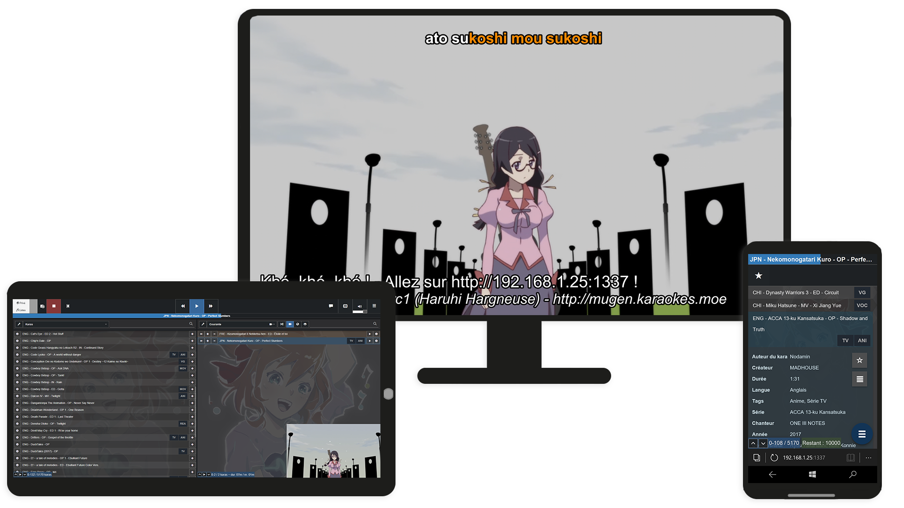

# Karaoke Mugen




Master branch: [](https://gitlab.com/karaokemugen/code/karaokemugen-app/commits/master) -
Next branch: [](https://gitlab.com/karaokemugen/code/karaokemugen-app/commits/next)

Project:      [](https://hosted.weblate.org/projects/karaoke-mugen/)

Social: [](http://karaokes.moe/discord) [](https://discourse.karaokes.moe) [](https://bsky.app/profile/karaokes.moe) [](https://shelter.moe/@KaraokeMugen)

Karaoke Mugen is a playlist manager and player for video and audio karaoke. It's made of a webapp and an engine. The webapp allows users to search for and add songs and admins to manage the karaoke session and playlists. The engine plays those songs on the computer used to display the video.

It works like a japanese karaoke where anyone can add songs one after another to a playlist with their smartphone, tablet or computer. The playlist can be reviewed by an operator or played "as is".

Karaoke Mugen can work without an Internet connection, but a few of its features need online access.

This is a mature product, battle-tested during anime conventions like [Jonetsu](http://www.jonetsu.fr), Japan Expo or Japanantes and similar events, weddings, anime nights between friends, etc. There still are some bugs remaining we'd like to exterminate, obviously :).

[Visit Karaoke Mugen's homepage](http://karaokes.moe)

## Features

- **Supported formats**:
    - **Video/Audio**: Anything supported by [mpv](http://mpv.io) really
    - **Subtiltes/Lyrics**: ASS, SRT, Karafun, KAR, Ultrastar, KBP
        - Apart from ASS and SRT, subtitles will get converted for use with mpv as it can't read them directly.
- **Streamer-friendly options**: Twitch chat triggers, Nico Nico Douga-style comments, text files with refreshed information for your layouts, and more.
- **Complete player controls**: Skip, pause, play, stop, rewind playback, hide/show lyrics, mute/unmute, pitch, speed and volume control.
- **Playlist management**: Reorder, shuffle, copy and move songs around between playlists
    - Playlists can be _current_ (used by the video player) and/or _public_ (where users can send songs to)
    - Playlists can be _hidden_ from public interface.
    - Some songs in the playlist can be _hidden_, these songs will be displayed as "???" to keep the surprise to public users.
    - Playlists can be _smart_ : automatically generate playlists depending on some criterias.
- **Blacklist and whitelist system**: Hide some songs from public view.
- **Complete metadata structure for songs**: Singers, songwriters, creators, authors, languages, categorization tags...
    - Complete **filter system** and **search engine** based on the aforementionned metadata.
- **System Panel** to configure Karaoke Mugen:
    - **Multi-karaoke repositories support**: You can add as many repositories you want. Karaoke Mugen comes with [its own](https://gitlab.com/karaokemugen/bases/karaokebase) of course.
    - **Configure** application behaviour and **view logs**
    - **Manage** your song library (add, remove, edit...)
    - **View stats** like most played or requested songs
- **User profiles** with access rights, favorites list, and preferences
- **Web interface** for smartphone/tablet/desktop ~~Internet Explorer compatible~~
    - Public interface can be set to _restricted mode_ to prevent adding songs or in _closed mode_ to prevent access while you prepare your karaoke.
    - Users can **add songs** they want from the library or their own favorites or anime lists (MAL/Anilist/Kitsu), follow the current playlist, see lyrics in real time from where they are (great for near-sighted people who want to sing along!)
    - Operators can **organize playlists** and control the player through the operator interface.
- **Highly customizable experience** to tailor the app to your specific needs (for twitch streams, in front of a crowd, between friends, for karaoke contests, etc.)
- **Display karaoke information** or operator announcements during song playback
- **Export/import** playlists and favorites
- **Quiz Mode** for blind tests
- And **many other things**! Check out the [feature list](http://mugen.karaokes.moe/en/features.html)

## How it works

- See the **[install](#install)** section below
- **Launch the app** (see the **[launch](#launch)** section below). You will be prompted with some questions and you will need to create an account (online or local).
- Karaoke Mugen will update its database on startup with the default karaoke repository. You can alternatively create your own repositories and karaokes. See the [karaoke base repository](https://gitlab.com/karaokemugen/bases/karaokebase) and [documentation](https://docs.karaokes.moe/contrib-guide/manage/).
- Once your playlist is ready, invite some friends and direct them to the public interface with their device. Let them add songs. Once enough songs are added, hit play and **have fun**!

Medias are downloaded on the go, but you can pre-download everything (beware, it's several hundred gigabytes big!) if you're preparing a karaoke event in a place without reliable Internet for example.

For more information, check out the [documentation site](http://docs.karaokes.moe)!

## System requirements

The app is multi-platform and works on Linux/Windows/macOS.

For source installs, it requires nodeJS 18 or above, as well as PostgreSQL, GNU patch, mpv and ffmpeg binaries (see below).

For binary installs, everything's included.

## Install

If you don't want to install manually, binaries are available [on the website](http://mugen.karaokes.moe/en/download.html) for Windows, Linux and macOS. The instructions below are for power users or devs who want to tinker with the app.

### Download

To install, git clone this repository with the `--recursive` flag since it uses git submodules or download one of the available binaries for macOS or Windows on [Karaoke Mugen's website](http://mugen.karaokes.moe/en).

```sh
git clone --recursive https://gitlab.com/karaokemugen/code/karaokemugen-app.git
```

### Config files and portability

If a file named `portable` exists in the same directory as KM, it will seek its config files in a `app` folder from that directory.

If that file does not exist, config and data files will be read from `~/KaraokeMugen/`.

Portable mode is useful if you're storing Karaoke Mugen AND its data on a removable media or an external hard drive.

### Required binaries

mpv (video player), ffmpeg (video/audio processing), GNU Patch (data updates), and PostgreSQL (database) are required by Karaoke Mugen.

#### Depending on your system

You can also define paths where to find those binaries in your `config.yml` file if you have them already installed elsewhere on your system and wish to use them. See `config.sample.yml` for examples.

You can download a complete package for mpv/ffmpeg/postgres/patch here:

- [Linux](https://mugen.karaokes.moe/downloads/dist_linux-7.x.tar.gz)
- [macOS](https://mugen.karaokes.moe/downloads/dist_mac-7.x.tar.gz)
- [Windows](https://mugen.karaokes.moe/downloads/dist_win-6.x.tar.gz)

Binaries must be placed in the `app/bin` folder (create it if it doesn't exist already).

If that's not the case, you can modify those paths in `config.yml`.

Make sure postgres is launched, [configured](#PostgreSQL) and ready for use.

If you're using Linux and wish to use your distribution's own binaries, beware: they often package old versions of ffmpeg/mpv/postgresql, update them first via their own websites' instructions if you're not using the ones we provide.

#### mpv

mpv 0.33 or later is required. ([mpv's website](http://mpv.io))

#### ffmpeg

ffmpeg 3 or later is required ([ffmpeg's website](http://www.ffmpeg.org))

#### Patch

You'll need a version of the GNU patch utility 2.7 or above so Karaoke Mugen can apply git-patches sent via Karaoke Mugen Server to keep your song lists up to date.

- On Windows, you can download a pre-compiled one [here](https://mugen.karaokes.moe/downloads/patch.exe)
- On macOS we recommend you use [Homebrew](https://brew.sh) to install GNU Patch.
- On Linux, make sure your distribution has the latest patch package.

#### PostgreSQL

PostgreSQL 16 or later is heavily recommended ([postgreSQL's website](https://www.postgresql.org/)).

Version starting from 12 can work but we're bundling 16 with the binary distribution of Karaoke Mugen, so we'll base any feature decision later on version 16's features.

Versions below 12 won't work.

Later PostgreSQL versions should work just fine.

Karaoke Mugen can use PostgreSQL in two ways :

- **Existing database cluster :** Connect to an existing PostgreSQL server (edit the `config.yml` file to point to the correct server and database). **This is the preferred way on Linux systems**.
- **Bundled PostgreSQL version :** If `bundledPostgresBinary` is set to `true` in `config.yml` (default) then Karaoke Mugen will seek a `app/bin/postgresql` directory. Inside, you should have a complete PostgreSQL distribution including a `bin`, `lib` and `share` folders. Karaoke Mugen needs to find the `pg_ctl` binary in the `bin` folder.

See [Database setup](#database-setup) for more information.

### Yarn

If you don't have `yarn`, install it first from [Yarn's website](http://yarnpkg.com)

Or simply do a `npm i -g yarn`

### Git submodules

Initialize some git config values either via `yarn gitconfig` or by hand:

```sh
git config diff.submodule log
git config fetch.recursesubmodules on-demand
git config status.submodulesummary true
git config push.recursesubmodules on-demand
git config submodule.recurse true
```

Use the `yarn pull` command (which is a shortcut for git pull with submodules) to update submodules.

### Dependencies

Launch `yarn` to install dependencies and build the React frontend

```sh
yarn install
yarn setup
```

This runs install on the app and frontend then builds them.

### Database setup

Karaoke Mugen needs a PostgreSQL database to work.

Create a `config.yml` and place it in your data directory (`~/KaraokeMugen` or `app/` in portable configurations). Edit it and add the following, filling in the blanks (username, password, port, host and database name of your choosing.) and switch `bundledPostgresBinary` to `false`. Leave `superuser` and `superuserPassword` blank. It should look like this :

```YAML
System:
  Database:
    bundledPostgresBinary: false
    database: karaokemugen_app
    host: localhost
    password: musubi
    port: 5432
    username: karaokemugen_app
```

As a superuser on PostgreSQL, you need to create the database properly. Use the `psql` command-line tool to connect to your PostgreSQL cluster and create the needed database and extension. Example with the `config.yml` above :

```SQL
CREATE DATABASE karaokemugen_app ENCODING 'UTF8';
CREATE USER karaokemugen_app WITH ENCRYPTED PASSWORD 'musubi';
GRANT ALL PRIVILEGES ON DATABASE karaokemugen_app TO karaokemugen_app;
```

Switch to the newly created database and enable the `unaccent` extension. We also need to grant permissions to public to create tables and such on the public schema. This is new since Postgresql 15.

```SQL
\c karaokemugen_app
CREATE EXTENSION unaccent;
GRANT CREATE ON SCHEMA public TO public;
```

#### User auth setup

On some Linux distributions, PostgreSQL is configured to use an Ident server to authorize users, even from localhost. Fedora 40 for example does that.

Under the `postgres` or `root` user, edit `/var/lib/pgsql/data/pg_hba.conf` (or wherever that file is on your system)

You should find two lines like this :

```
# IPv4 local connections:
host    all             all             127.0.0.1/32            ident
# IPv6 local connections:
host    all             all             ::1/128                 ident
```

For both lines, change `ident` to `scram-sha-256`. Save and restart your postgresql service.

All done!

### Launch

If you're running on a headless Linux install, see [the following section.](#headless-install)

If you're running on any other system with a graphical interface, To launch the app :

```sh
yarn start
```

Generating a database ie required on first launch and is done automatically if the database specified in `config.yml` is empty.

On first run, the app will make you create an admin user and decide on a few base settings. You'll get to follow a guided tour of the operator panel too. You can trigger this tour process again by selecting the Tutorial item in the K menu on the app's operator panel.

### Headless install

Our runtime is Electron and it needs a graphical server to work, but we can go around that. Once launched, Karaoke Mugen is reachable with a browser by going to `http://<your_ip>:1337`.

To launch an Electron app without an attached X Server you'll need `Xvfb` installed

```sh
export DISPLAY=':99.0'
Xvfb :99 -screen 0 1920x1080x24 > /dev/null 2>&1 &
yarn startHeadless
```

## API

If you wish to create your own client for Karaoke Mugen or interact with its API, please see [the dedicated API documentation site](https://api.karaokes.moe/app)

## Translations

### Frontend

[](https://hosted.weblate.org/engage/karaoke-mugen/)

### Backend

[](https://hosted.weblate.org/engage/karaoke-mugen/)

## Contact

You can contact us by either

- Creating an issue
- Going to the [contact page](http://mugen.karaokes.moe/en/contact.html) and picking the communication channel of your choice.

## How to contribute

Karaoke Mugen is created by people who like anime, karaoke, etc. You can help us ~~fill the world with karaoke~~!

For code/development contributions, read the [contributing guide](CONTRIBUTING.md)

Everything's there, and if you have questions, you can come to [our Discord](http://karaokes.moe/discord) in the #dev channel!

Another way is to post on [our Discourse Forum](https://discourse.karaokes.moe)

## Donations

We accept donations through Patreon, Liberapay or Paypal directly. If you're interested in helping us pay for our infrastructure and other projects, please donate! [For more information on why we need money and how to donate, see this news article on our site](https://mugen.karaokes.moe/en/2021/11/16/donations.html)

## Special thanks


Thanks to the [Sentry error tracking](https://sentry.io/welcome?utm_source=KaraokeMugen) solution, the app is self-reporting its errors to maintainers to help them to fix issues.<br/>


Thanks to the [BrowserStack testing solution](https://browserstack.com), we can be sure that our interfaces will run just fine on all devices.


Thanks to [MacStadium](http://www.macstadium.com), we have a Mac mini M1 to run tests and CI to build Karaoke Mugen for the Silicon architecture!


Thanks to [Weblate](https://weblate.org) we can allow people to more easily contribute to translating the app in many languages!!

## Credits

"Nanamin", Karaoke Mugen's mascott as well as Karaoke Mugen's logo are designed by [Sedeto](http://sedeto.fr)

## License

Karaoke Mugen is licensed under MIT License. Other projects related to Karaoke Mugen may have other license terms. Please check every project for more information.
