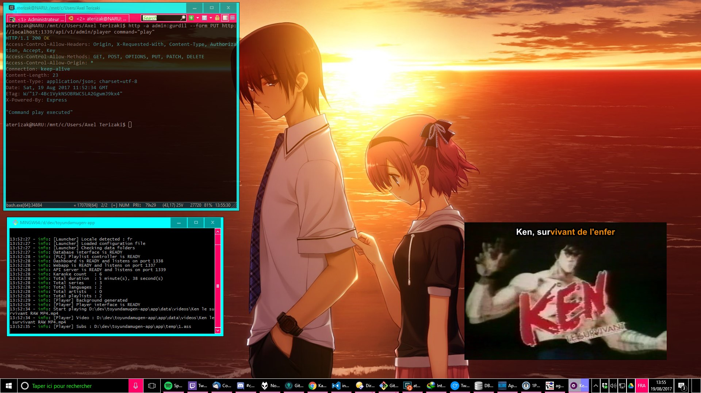
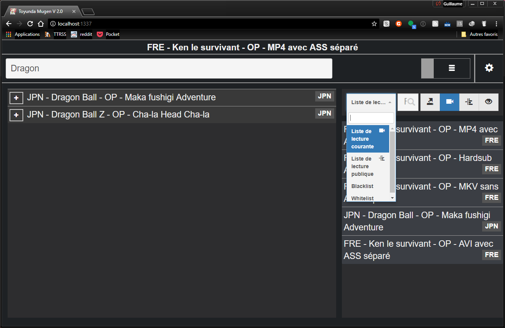
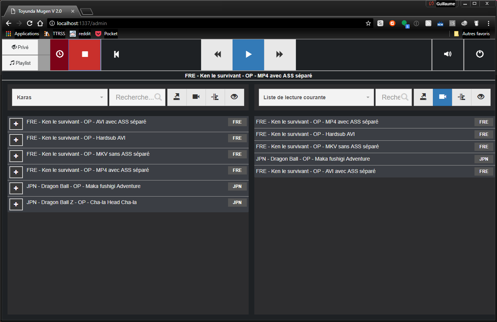

# Karaoke Mugen

Bienvenue dans Karaoke Mugen. 

Karaoke Mugen est un système de gestion de playlist de karaoke vidéo. Il se présente sous la forme d'une appli web et d'un moteur. L'appli web permet aux gens d'ajouter des chansons à la playlist et l'administrateur de gérer cette playlist. Le moteur tourne et lance ces chansons sur l'ordinateur qui projette les vidéos.

Il fonctionne comme un karaoké à la japonaise où chacun peut ajouter des chansons à la suite de la playlist via son smartphone, tablette ou ordinateur. Un autre mode permet au public d'ajouter des vidéos à une liste de suggestions que l'administrateur prendra soin d'ajouter ou non.

## Captures d'écran

Pour le moment, l'accès par l'interface web n'est pas encore 100% fonctionnel, mais ça arrive ! Il reste toujours l'API :



### Interfaces web en cours de développement

Photos non contractuelles, tout ça.





## Téléchargement

L'application est déjà bien avancée et utilisable, l'interface Web n'est pas encore terminée par contre, mais l'API est fonctionelle pour piloter l'app.

Pour installer, clonez le dépôt, puis

```
npm install
```

Attention, si votre dossier d'installation contient des espaces, le module `ffmpeg-downloader` va planter à l'installation.

Créez un dossier `app/data` puis balancez le contenu du dossier `samples` dedans, pour tester. 

Pour lancer l'app :

```
npm start
```

La génération de la base de données est nécessaire à la première utilisation, vous pouvez la déclencher en vous connectant sur http://localhost:1338 (mot de passe par défaut `gurdil`) et en ayant placé des karaokés dans app/data/ (voir plus bas)

## Pré-requis système

N'importe quoi qui fait tourner node.js (l'application sera prépackagée).

L'application fonctionne sous OSX/Linux/Windows.

Sous Linux vous aurez cependant besoin de :
* mpv
* ffmpeg / ffprobe

Sous Windows et OSX les binaires seront téléchargés automatiquement.

    
## Langages

Karaoke Mugen est écrit en node.js et contient quelques scripts bash à usage unique.

## Fonctionnalités

Certaines sont encore à venir, mais ça doit vous donner une idée de l'étendue du projet

- Gère vidéos seules ou vidéos + sous-titres embarqués.
- Gère le formats de sous-titrage .ass 
- Permet de passer une chanson
- Affiche les paroles des chansons dans l'interface
- Mettre le karaoke en pause ou le relancer
- Shuffle de la playlist
- Ajout de la base entière dans la playlist
- Arrêt complet depuis l'interface web
- Interface pour smartphone/tablette et PC, ~~compatible IE6~~
- Affiche le titre du karaoké au début de la vidéo.
- Système de mise à jour rsync intégré si vous avez votre propre base de karaokés sur un serveur dédié.
- Système de tags pour les karaokés : année, studio, chanteur/euse, compositeur/euse, langue...
- Savoir qui a demandé tel karaoké parmi vos invités.
- Pilotage du lecteur depuis l'interface admin 
- Mode public ou privé :
   - En mode privé (par défaut) les karaokés ajoutés par les utilisateurs sont directement mis à la suite dans la playlist courante.
   - En mode public, les karaokés sont ajoutés à une liste de suggestions et c'est à l'administrateur de décider quelles chansons ajouter !
- Export/import de playlists
- API REST pour le développement d'autres interfaces ou de clients mobiles


## Comment ça fonctionne

* Voir la partie téléchargement
* Placez des karaoké à l'intérieur d'un dossier `app/data`. Voir https://lab.shelter.moe/karaokemugen/karaokemugen-base 
* L'interface web écoute par défaut sur le port 1337 : http://localhost:1337 - celle-ci est encore en travaux sur une branche dédiée du code
* L'interface API écoute sur le port 1339
* Un panel web admin pour les tâches de gestion comme la génération de la base de données où les mises à jour est sur le port 1338. 
Sur le dépôt cité plus haut, vous trouverez une base de karaokés déjà prête à l'emploi. Attention, celle-ci pèse 160 Go une fois les vidéos téléchargées.

## Comment participer au code

Lisez le Wiki ! 
https://lab.shelter.moe/karaokemugen/karaokemugen-app/wikis/home

Tout y est expliqué, ou presque, et si vous avez des questions, il y a un lien vers le Discord où nous échangeons quotidiennement !

## Ancienne version

Une version "legacy" en PHP existe sur ce dépôt :
https://lab.shelter.moe/karaokemugen/toyundamugen-app-legacy

Cette version est fonctionelle mais assez basique.
